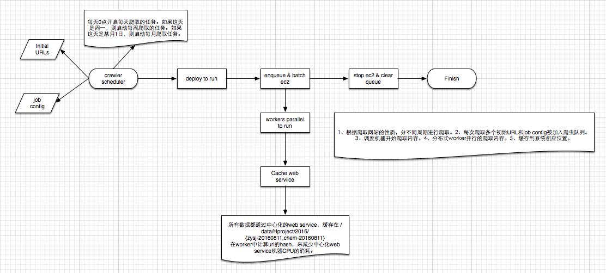

# Hcrawler 项目爬虫的设计

## 一、需要爬取的网站和分类

* 每月更新

  中医世家网，包含中药材性质（zysj）
  ***

* 每周更新

  药监局国产药品，包含药品登记注册的信息，厂商等。(yaojianju)

  药监局进口药品，包含进口药品的各种注册信息，厂商等。(yaojianjuoversea) (赵逸轩待完成爬取, 和GMP的爬取)

  中国化工网，包含化学品性质及供应商信息。（chem）(王英麒待完成供应商爬取)
  ***

* 每日更新

  生意社农副频道，每日更新农副产品报价（chemppidaily）

  生意社化工频道，每日更新化学品报价（agriculdaily）

  康美中药网，每日更新中药材报价（kmzydaily）

  药通网，每日更新药材报价（ytyaocai）
  
  中华粮网，更新农副产品报价（不一定每日所有产品都有更新）（cngrain）
  ***

* 一次性获取

  康美中药网，包含中药材历史价格（kmzy-20160808）
  
  生意社农副频道，包含最近的农副产品报价（agricul-20160810）
  
  生意社化工频道，包含最近的化学品报价（chemppi-20160811）

  
## 二、爬取和更新的逻辑

  1. 程序每天UTC 0点启动每天爬取的任务。如果这天是周六，则子进程爬取每周任务。如果这天是某月1日，则子进程爬取每月任务。子进程爬取每天任务。
  2. 每月、每周、每天需要更新的网站，分别有一个配置文件在 awscrawler/config_prefetch/hcrawler/{daily.json,monthly.json,weekly.json}，子进程读取配置文件，并调用 awscrawler/invoker/multitask.py 开始爬取任务，给batch_id 自动加上当天的日期。
  3. 读取配置文件里面对应的初始化URL到redis 队列，并启动配置数量的ec2 worker，开始爬取网页，并把爬取网页中分析到新网页再加入到redis 队列中。
  4. 每个ec2 worker读取中心化redis 队列中的batch_id和url，多个batch_id 对应的多个网站同时爬取，自动动态计算其他网站爬取的耗时，减少一个网站爬取两个url的间隔时长。
  5. 爬取的网页没有缓存，爬取的结果以json stream的形式缓存在crawlerservice的机器上。缓存目录在 /data/hproject/2016/{zysj-20160811,chem-20160811}。在worker中计算url的hash，来减少中心化web service机器CPU的消耗。
  6. url全部爬取完毕，awscrawler/invoker/multitask.py 中的调度terminate 刚开启的ec2机器，并把失败的url写入redis/2 的失败队列中。
  7. 爬取失败的URLs存储在redis/2 的失败队列中。用 awscrawler/failed/get_failed_url.py 来生成失败url的文件。
  8. crawlerservice中缓存的文件，通过清洗，存储在数据schema 为 ruyiwebcrawl/projects/cleansing_hcrawler/hcrawler_models.py 文件定义的mongo数据库中。

## 三、爬取的设计图

